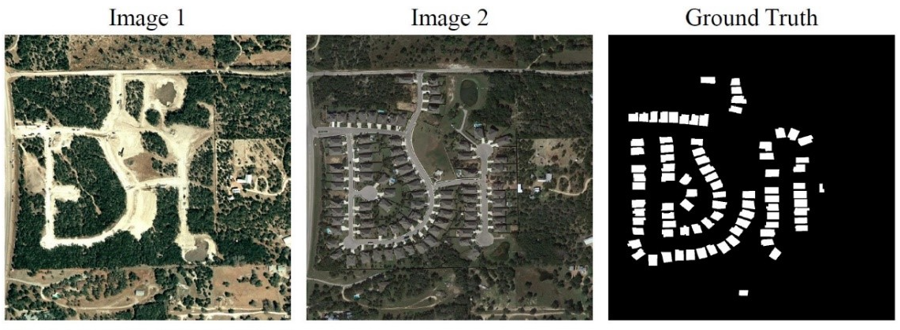

# 遥感图像智能解译平台需求说明书 v2

| 修改记录      |         |           |             |
| --------- | ------- | --------- | ----------- |
| 时间        | 修改者     | 版本        | 备注          |
| 2022/4/3  | 曾凡宇     | Version 1 | 需求报告书初版编写完成 |
| 2022/4/10 | 高继垚，曾凡宇 | Version 2 | 添加参考资料，序列图  |

### 第一章 文档概述 

### 1.1 编写目的 

此可行性分析报告目的是为“遥感图像智能解译平台”开发的可能性、可行性、必要性提供论据，为开发人员进行系统总体规划设计以及具体实施开发工程必要的参考资源。在系统开发完成后期为系统的测试验收提供帮助。

预期的读者：本项目的全体开发人员，项目的利益相关者。

### 1.2 背景 

* 选题背景

遥感是20世纪60年代兴起并迅速发展起来的一门综合性探测技术，它利用非接触传感器使人们能离开地球来获取有关地球的时空信息，不仅着眼于解决传统目标的几何定位，更为重要的是对利用外层空间传感器获取的影像和非影像信息进行语义和非语义解译，提取客观世界中各种目标对象的物理特征和信息，从而为人们认识自然和改造自然提供科学的技术和方法。

遥感数据具有覆盖范围及时域广、获取迅速、动态信息强等特点，已广泛应用于城市规划、气象预测、环境保护、防灾减灾、农林业监测等领域并取得了良好的经济和社会效益。近年来，随着遥感技术的进一步发展和新一代高分辨率卫星系统相继投入应用，我国遥感领域已步入了高分辨率影像的快车道，对遥感数据的分析应用服务需求与日俱增。传统方式对高分辨率卫星遥感图像的特征刻画能力差且人工成本高。随着人工智能及深度学习技术快速发展，通过应用深度学习技术可以加速遥感领域智能化应用，促进遥感数据处理走向智能化，使遥感事业更好地服务国计民生。

* 待开发的系统名称：

遥感图像智能解译平台

* 项目的任务提出者：

高继垚、裴轩宇、曾凡宇、郭运鹏

* 项目开发者：

高继垚、裴轩宇、曾凡宇、郭运鹏

* 项目主体用户：

地理遥感相关分析从业人员，气象监测，农林监测人员，城市规划人员等

* 范围：

“遥感图像智能解译平台”是应用深度学习技术，对遥感照片进行智能化处理的系统，该应用向用户提供以下功能：

* 目标提取
* 变化检测
* 目标检测
* 地物分类

### 1.3 定义 

**遥感图像：**遥感影像（简称：RS，英文：Remote Sensing Image）是指记录各种地物电磁波大小的胶片或照片。

**用例**：用例（英语：use case）是软件工程中对系统如何反应外界请求的描述，是一种通过用户的使用场景来获取需求的技术。每个用例提供了一个或多个_场景_，该场景说明了系统是如何和最终用户或其它系统互动，也就是谁可以用系统做什么，从而获得一个明确的业务目标。

**图像分割**：图像分割（segmentation）指的是将数字图像细分为多个图像子区域（像素的集合，也被称作超像素）的过程，目的是简化或改变图像的表示形式，使得图像更容易理解和分析。

**用户界面：**用户界面（User Interface，简称UI，亦称使用者界面）是系统和用户之间进行交互和信息交换的媒介，它实现信息的内部形式与人类可以接受形式之间的转换。

**消息队列：**一种异步的服务间的通信方式，消息在被处理和删除之前一直存储在消息队列上等待取用。

**幂等性：**程序中的幂等操作指程序任意多次执行所产生的影响均与第一次的相同。

1.4 参考资料

\[1]830-1998-IEEE Recommended Practice for Software Requirements Specifications\[DB/OL].[https://ieeexplore.ieee.org/document/720574](https://ieeexplore.ieee.org/document/720574)

\[2]百度飞桨赛题一：基于深度学习的遥感图像智能解译平台\[EB/OL].

[https://aistudio.baidu.com/aistudio/competition/detail/151/0/introduction](https://aistudio.baidu.com/aistudio/competition/detail/151/0/introduction)

### 第二章 任务概述 

### 2.1 目标 

“遥感图像智能解译平台”主要目的是帮助从业人员减少手动标注图像的任务的工作，让使用人员更加专注于对现有图像结果的分析和使用。本系统采用B/S结构，用户通过web程序上传需要处理的遥感图像并选择要进行的处理操作，服务器端根据已训练好的对应模型对图像处理后返回给用户端以展示。本项目独立于其它应用，是一个完全自包含的系统，利于用户直接进行使用。

### 2.2 用户特征 

系统的主要用户群体是需要使用遥感图像观测分析的相关从业人员，对遥感图像本身具备一定了解认识，对使用遥感图像在进行数据分析，用地监测，农林业监测等具体的应用场景有需求。

### 2.3 相关事实与假定 

* 开发人员均严格遵守项目报告书的时间规划以及需求说明书要求进行开发
* 开发者使用的Python版本，PaddlePaddle版本都应保持一致
* 开发人员的设备都应带有英伟达独立显卡，且只能使用单卡
* 开发人员具有遥感图像相关先验知识
* 项目需要同时能够在本地机器以及云服务器上进行部署访问

### 第三章 需求描述 

### >)3.1系统用例 

### 3.2功能性需求 

#### 3.2.1 目标检测 

| 需求名称       | 目标检测                                      |
| ---------- | ----------------------------------------- |
| 需求描述       | 使用目标检测技术对用户上传的遥感图片中的指定对象完成检测，并且在图像上框选标记出来 |
| 输入         | 尺寸为1024\*1024的卫星遥感图像，格式为.png              |
| 输出         | 尺寸为1024\*1024的遥感图像，且标注出其中的待检测目标           |
| 优先级（H/M/L） | High                                      |

**3.2.1.1 用例描述**

用例名：目标检测

目标 ：用户上传遥感图像，系统将遥感图像中的待检测对象标注出来

优先级：高

执行者：使用平台的用户

主事件流：

1）用户选择“目标检测”功能

2）用户上传待处理的遥感图片

3）点击“识别”按钮

4）使用已训练好的对应模型处理图片

5）返回用户待测目标被标记出来的图片

可选路径：无

前置条件：无

后置条件：用户得到目标被检测标记出来的图片，可供后续分析使用

失败条件：上传的图片尺寸不合规，内容不合规；网络连接问题导致图像上传失败

>)**3.2.1.2 活动流程**

**3.2.1.3示例**

#### 3.2.2 目标提取 

| 需求名称       | 目标提取                                                   |
| ---------- | ------------------------------------------------------ |
| 需求描述       | 使用图像分割技术对用户上传的遥感图片中的指定对象完成分割，本平台支持在单幅图像或一系列图像中将建筑物分割开来 |
| 输入         | 尺寸为1024\*1024的卫星遥感图像，格式为.png                           |
| 输出         | 尺寸为1024\*1024的遥感图像，并已经将图中的待提取对象全部分割出来                  |
| 优先级（H/M/L） | High                                                   |

**3.2.2.1 用例描述**

用例名：目标提取

目标 ：用户上传遥感图像，系统将遥感图像中的待检测对象提取分割

优先级：高

执行者：使用平台的用户

主事件流：

1）用户选择“目标提取”功能

2）用户上传待处理的遥感图片

3）点击“识别”按钮

4）使用已训练好的对应模型处理图片

5）返回用户待提取目标被分割出来的图片

可选路径：无

前置条件：无

后置条件：用户得到目标都被分割出来的图片，可供后续分析使用

失败条件：上传的图片尺寸不合规，内容不合规；网络连接问题导致图像上传失败

>)**3.2.2.2 活动流程**

>)**3.2.2.3示例：**

#### 3.2.3 地物分类 

| 需求名称       | 地物分类                                    |
| ---------- | --------------------------------------- |
| 需求描述       | 使用图像分割技术对用户上传的每个像素完成分类并在图中标注            |
| 输入         | 尺寸为1024\*1024的卫星遥感图像，格式为.png            |
| 输出         | 尺寸为1024\*1024的图像，图像中不同的地质类型被使用不同颜色 标记出来 |
| 优先级（H/M/L） | High                                    |

**3.2.3.1 用例描述**

用例名：地物分类

目标 ：用户上传遥感图像，系统将图中的不同地质类型识别并且标注出来

优先级：高

执行者：使用平台的用户

主事件流：

1）用户选择“地物分类”功能

2）用户上传待处理的遥感图片

3）点击“识别”按钮

4）使用已训练好的对应模型处理图片

5）返回用户地质类型已被分类标记出来的图片

可选路径：无

前置条件：无

后置条件：用户得到不同的地质类别被标注出来的图片，可供进一步分析使用

失败条件：上传的图片尺寸不合规，内容不合规；网络连接问题导致图像上传失败

>)**3.2.3.2 活动流程**

**3.2.3.3示例**

#### 3.2.4 变化检测 

| 需求名称       | 变化检测                                                        |
| ---------- | ----------------------------------------------------------- |
| 需求描述       | 用户上传两张不同时间拍摄的同一地区的遥感图像，系统通过对图像的比对，利用图像分割技术对该区域两个时期的变化情况完成分析 |
| 输入         | 两张摄于同一地区不同时期的尺寸为1024\*1024的卫星遥感图像，格式为.png                   |
| 输出         | 尺寸为1024\*1024的单通道png格式的灰度图                                  |
| 优先级（H/M/L） | High                                                        |

**3.2.4.1 用例描述**

用例名：变化检测

目标 ：两张摄于同一地区不同时期的卫星遥感图像，系统对该区域两个时期的变化进行分析，得到反映变化结果的灰度图

优先级：高

执行者：使用平台的用户

主事件流：

1）用户选择“变化检测”功能

2）用户上传待处理的遥感图片

3）点击“识别”按钮

4）使用已训练好的对应模型处理图片

5）返回用户反映该地区两个时期的变化的灰度图

可选路径：无

前置条件：无

后置条件：用户得到处理后的图片，可以进行下一步使用

失败条件：上传的图片尺寸不合规，内容不合规；网络连接问题导致图像上传失败；上传的图片并非拍摄于同一地区

**3.2.4.2 活动流程**

**3.2.4.3 示例**

### 3.3 非功能性需求 

* 用户界面应简洁清晰，不过多占用遥感图像展示的空间，且保证用户能够直观辨识出该平台所具备的功能。
* 系统的相应速度要在用户体验较为舒适的区间，对图片的上传和处理操作应在3-5s完成。
* 支持用户同时上传一系列遥感图像，且在整个处理过程中需要保持能够提供实时响应，可以通过消息队列的方式进行异步处理和返回图片。
* 提供幂等性支持，以防止加载处理图片过程中用户重复提交。
* 提供开发者联系方式，以供用户交流反馈。

### 4 环境规定 

### 4.1开发环境 

* 操作系统：

windows7/8/10 专业版/企业版（64bit）

* 硬件设备：

GPU版本支持CUDA 10.1/10.2/11.2，且仅支持单卡

* 软件环境：

Pycharm Professional 2021.3.3;

Vistual Studio Code 1.66;

XShell 5;

Python 3.8;

PaddlePaddle2.2;

* 外部系统接口：无

### 4.2 运行环境 

* 网络连接：

需要连接网络访问

* 浏览器：

Chrome， FireFox，Edge等常见浏览器均可运行
