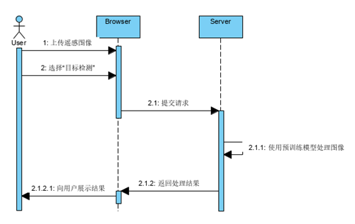

# 项目设计

### **3.1 项目概况**

#### **3.1.1 项目特点** 

基于百度PaddlePaddle深度学习框架，以及百度AI Studio开发平台的算力支持，使用飞浆官方提供的训练集数据，进行模型训练，并利用训练的模型，搭建一个web端的遥感图像解译平台，能够实现对用户上传的遥感图像进行变化检测，目标检测，目标提取以及地物分类四个功能，并对结果进行相应的可视化以及创新处理，使用户能够直观从结果图中获取到关键信息。

由于遥感图像的尺寸本身较大，在上传和下载图片时，需要考虑到由于文件大小和网络状况引起的非必要卡顿，所以需要对项目结构进行相应的优化，并使用到一定的缓存和预加载技术，提高系统的响应速度。

另外，现实中的遥感图像处理平台大多是采用“免费体验，收费服务”的功能，本项目为了更加贴近市面上实际的遥感解译平台，并且防止用户过度使用而使服务器超负载，我们还需要针对用户的身份提供不同的使用次数限制。当然，由于软件本身无法收费，本功能仅仅只是作为一个象征性内容而存在，实际上对每个用户都提供了十分充裕的使用次数，足够用户充分使用平台的所有功能。

最后，不管是在开发环节所用到的依赖包，还是项目运行所需要的环境搭建，都比较繁琐。为了尽可能减少拿到源代码后的配置工作，方便从头跑通整个项目，我们对代码中所用到的相关python库，都汇总在requirements.txt中，方便使用者一键安装与开发环境完全一致的依赖包。对于paddlepaddle框架相关依赖的安装，同样会提供详细说明使用。

### **3.2 项目开发计划** 

#### **3.2.1 工作内容** 

完成项目工作计划安排，进行系统需求分析，系统架构设计，技术选型等前置内容。并选择一款市面上常用的项目管理平台对整个项目进行全局把控。最后持续迭代性地对系统进行模型训练，调优，以及web开发，并最终完成交付。

### **3.3 项目的开发内容和结果** 

#### **3.3.1 系统需求分析** 

**3.3.1.1介绍**

* 待开发的系统名称：遥感图像智能解译平台

遥感图像智能解译平台

* 项目的任务提出者：高继垚、郭运鹏、裴轩宇、曾凡宇
* 项目开发者：高继垚、郭运鹏、裴轩宇、曾凡宇

项目主体用户：

地理遥感相关分析从业人员，气象监测，农林监测人员，城市规划人员等

* 范围：

“遥感图像智能解译平台”是应用深度学习技术，对遥感照片进行智能化处理的系统，该应用向用户提供以下功能：

* 目标提取
* 变化检测
* 目标检测
* 地物分类

**3.3.1.2 定义**

**遥感图像**：遥感影像（简称：RS，英文：Remote Sensing Image）是指记录各种地物电磁波大小的胶片或照片。

**用例**：用例（英语：use case）是软件工程中对系统如何反应外界请求的描述，是一种通过用户的使用场景来获取需求的技术。每个用例提供了一个或多个_场景_，该场景说明了系统是如何和最终用户或其它系统互动，也就是谁可以用系统做什么，从而获得一个明确的业务目标。

**图像分割**：图像分割（segmentation）指的是将数字图像细分为多个图像子区域（像素的集合，也被称作超像素）的过程，目的是简化或改变图像的表示形式，使得图像更容易理解和分析。

**用户界面**：：用户界面（User Interface，简称UI，亦称使用者界面）是系统和用户之间进行交互和信息交换的媒介，它实现信息的内部形式与人类可以接受形式之间的转换。

**3.3.1.3 用户特征**

系统的主要用户群体是需要使用遥感图像观测分析的相关从业人员，对遥感图像本身具备一定了解认识，对使用遥感图像在进行数据分析，用地监测，农林业监测等具体的应用场景有需求。

**3.3.1.4 相关事实与假定**

* 开发人员均严格遵守项目报告书的时间规划以及需求说明书要求进行开发
* 开发者使用的Python版本，PaddlePaddle版本都应保持一致
* 开发人员具有遥感图像相关先验知识
* 项目需要同时能够在本地机器以及云服务器上进行部署访问

**3.3.1.5 功能需求**

**1）目标检测**

**用例描述**

用例名：目标检测

目标 ：用户上传遥感图像，系统将遥感图像中的待检测对象标注出来

优先级：高

执行者：使用平台的用户

主事件流：

1）用户选择“目标检测”功能

2）用户上传待处理的遥感图片

3）点击“识别”按钮

4）使用已训练好的对应模型处理图片

5）返回用户待测目标被标记出来的图片

可选路径：无

前置条件：无

后置条件：用户得到目标被检测标记出来的图片，可供后续分析使用

失败条件：网络连接问题导致图像上传失败；用户使用次数不足

**活动流程**

**2）目标提取**

**用例描述**

用例名：目标提取

目标 ：用户上传遥感图像，系统将遥感图像中的待检测对象提取分割

优先级：高

执行者：使用平台的用户

主事件流：

1）用户选择“目标提取”功能

2）用户上传待处理的遥感图片

3）点击“识别”按钮

4）使用已训练好的对应模型处理图片

5）返回用户待提取目标被分割出来的图片

可选路径：无

前置条件：无

后置条件：用户得到目标都被分割出来的图片，可供后续分析使用

失败条件：网络连接问题导致图像上传失败；用户使用次数不足

**活动流程**

**3）地物分类**

**用例描述**

用例名：地物分类

目标 ：用户上传遥感图像，系统将图中的不同地质类型识别并且标注出来

优先级：高

执行者：使用平台的用户

主事件流：

1）用户选择“地物分类”功能

2）用户上传待处理的遥感图片

3）点击“识别”按钮

4）使用已训练好的对应模型处理图片

5）返回用户地质类型已被分类标记出来的图片

可选路径：无

前置条件：无

后置条件：用户得到不同的地质类别被标注出来的图片，可供进一步分析使用

失败条件：网络连接问题导致图像上传失败；用户使用次数不足

**活动流程**

**4）变化检测**

**用例描述**

用例名：变化检测

目标 ：两张摄于同一地区不同时期的卫星遥感图像，系统对该区域两个时期的变化进行分析，得到反映变化结果的灰度图

优先级：高

执行者：使用平台的用户

主事件流：

1）用户选择“变化检测”功能

2）用户上传待处理的遥感图片

3）点击“识别”按钮

4）使用已训练好的对应模型处理图片

5）返回用户反映该地区两个时期的变化的灰度图

可选路径：无

前置条件：无

后置条件：用户得到处理后的图片，可以进行下一步使用

失败条件：网络连接问题导致图像上传失败；用户使用次数不足；

**活动流程**

**3.3.1.6 非功能性需求**

* 用户界面应简洁清晰，不过多占用遥感图像展示的空间，且保证用户能够直观辨识出该平台所具备的功能。
* 系统的相应速度要在用户体验较为舒适的区间，对图片的上传和处理操作应在3-5s完成。
* 对处理结果进行适当的可视化和数据统计处理，增强可阅读性。
* 支持用户同时上传一系列遥感图像，且在整个处理过程中需要保持能够提供实时响应，可以通过消息队列的方式进行异步处理和返回图片。
* 提供幂等性支持，以防止加载处理图片过程中用户重复提交。
* 提供开发者联系方式，以供用户交流反馈。

#### **3.3.2 系统设计** 

**3.3.2.1体系架构设计**

本系统主要分为三个模块：功能体验模块，用户认证模块，遥感图像处理模块。其中，功能体验模块主要是提供给首次使用平台，或者是未注册账号的平台用于了解平台功能，通过预先给定的内置遥感图像，预览处理后的结果。用户认证模块则是用于校验用户身份，防止用户大量提交处理请求，加重服务器运作负载。遥感图像处理模块是整个系统的核心功能，包含了目标提取，目标检测，变化检查，地物分类四个功能。用户可以在该部分上传一张或者是多张遥感图像，并选择要进行处理的功能，便可以获得对遥感图像进行信息提取归类之后的结果。

#### 3.3.3 系统具体设计思路

**3.3.3.1 算法设计**

首先，针对我们系统所面对的具体业务场景，即卫星遥感图像的处理与分析，我对遥感图像的具体特点进行了分析并总结如下：

遥感影像经过多尺度分割后，形成影像对象层，每-层都是由若干个多边形组成的，而每一个多边形由若干个像元组成。因此，每个对象就具有光谱特征、形状特征、纹理特征，同一层内对象之间有拓扑关系，不同层次上对象间有相关特征。这些特征又可以归纳为三类: -是内在特征，主要包括对象的像素值、对象形状特征、对象纹理特征等；二是拓扑关系，主要描述对象之间的空间关系；三是对象间的相关特征，描述父对象和子对象之间的关系。面向对象的分类实际上就是根据影像对象的特征依据某种分类规则对所有的对象进行分类。在分类过程中，并不是选择的特征越多，分类的精度就越高，因为特征数量过多会增加运算量，降低运算效率，另一方面添加了非本质特征就等于混入了噪声，反而会降低分类精度。

具体而言，我们对得到的数据进行了以下的预处理：辐射定标——大气校正——几何校正——正射校正，由于传感器生成的图像像元相对于地面目标实际位置发生了挤压、拉伸、扭曲和偏移，便须进行几何校正，以消除或改正遥感影像几何误差；除此之外，我们还进行了大气校正，其目的是消除大气和光照等因素对地物反射的影响，获得地面反射率、辐射率、地表温度等真实物理模型参数，用来消除大气中水蒸气、氧气、二氧化碳、臭气等地物反射的影响，消除大气分子和气溶胶散射的影响。

在完成了遥感图像数据的预处理之后，通过对该领域学术研究的前沿的了解，我们最终选取了BIT模型作为基础来构建我们的推理模型。该模型使用了双时态图像Transformer，以便在空间-时间域内有效地对上下文信息进行建模。BIT将双时态图像表达为几个标签token，并使用Transformer编码器在紧凑的基于token的时空中建模上下文。然后，学习到的富含全局信息的token被反馈到像素空间，通过Transformer解码器细化原始特征。

在BIT的基础上，我们针对实际应用中该模型的图像特征处理提取能力较差的问题，对其进行了以下层面的改进：首先，我们对较大分辨率的输入图像做出了图片切割的处理，以克服模型对细小变化感受不足的问题。其次，我们将模型的骨干网络替换为了ResNet-50,以更好的对图像的特征进行提取。再次，我们采取了平均直方图匹配的做法来使得测试集与训练集同分布化，最终，我们使用了模型集成的思路，将多个尺度多个不同骨干网络的模型集成起来进行推理，以增强模型对不同尺度的感受野和对不同种类特征的提取能力。最终取得的成绩如下表所示：

**3.3.3.2 后端设计**

**3.3.3.2.1 用户注册**

在本项目中，为了对用户过于频繁乃至是恶意的提交进行限制，需要对用户身份进行限制，所以在使用平台功能之前，必须在平台注册一个账号。

注册账号时，用户需要填写的字段有 user\_name, email\_address, password, 其中的email\_address 必须是真实有效的，用户填写完信息之后点击“发送验证码”的按钮，前端会将用户填写的信息第一次提交给后台，后台生成一个随机的六位整数的验证码。用户在点击发送验证码按钮之后，首先会对接收到的邮箱进行验证，在User表中检查该邮箱是否已经注册过账号，如果已经注册过账号，则会返回 403 Forbidden状态码和对应的提示信息。如果该邮箱还没有被注册，则会在“vtf\_code”这张表里检查这个邮箱是不是第一次接收验证码，如果是第一次接收，则会在vtf\_code表中新增一条保存邮箱地址和生成的验证码的记录。如果不是第一次接收，那么“vtf\_code”表中应当已经存在该邮箱和过去接收的验证码，这时只需要将曾经保存的验证码替换成最新生成的验证码，从而确保校验时的正确性。

用户在接收到验证码之后，应将验证码填入到对应的文本框中，并再次点击“注册”按钮，前端会提交整个页面的表单数据到后台，后台在user表中创建一条新纪录，并返回200 http状态码，注册流程便在此结束。

由于RESTful的URL的规则是只能含有名词，然后通过http请求中的请求方法的差别来判断对资源进行怎样的操作，例如有如下url：loaclhost/image/，请求方法是GET表示从服务器获取资源，应当返回image给用户，如果是POST，则表示修改资源，DELETE则表示要删除所请求的资源。在本项目的用户认证模块，注册账号可以看作是在服务器上新增了一条资源记录，所以最后决定设计的接口表示为：POST /scupp /user。另外，由于RESTful要求所有的请求都是无状态的，所以每次在发送请求时，都需要携带完整的用户身份信息，在所有请求体中都需要包含有可以唯一标记用户身份的“email\_address”字段。

**3.3.3.2.2用户登录**

在没有添加种种安全限制和性能限制的前提下，登录模块本身的实现比较简单。在本项目的开发过程中，在这一模块的主要工作也是因为规定了必须使用RESTful风格的API设计，所以在URL的设计上与用户注册出现了一定的冲突。登录功能本身并没有请求资源，通常来看也不存在对服务器资源进行修改，所以一时间对url的设计和请求方法的设计出现了一些迷茫。最后的url选择了与注册完全相同的 POST / scupp/ user，理由是可以将登录看作是在服务器创建了新的会话，所以同样选择了POST方法。而为了区别注册和登录时对同一个url发起请求的相应，我们限制在请求体中添加一个“action”参数，其取值只能为login和register，以此来确定用户的行为。

**3.3.3.2.3 遥感图像处理模块**

此模块是系统的核心功能模块，主要负责基于算法设计人员训练完成的模型，对用户上传的图片进行目标提取，目标检测，地物分类，变化检测的结果预测。影响本模块的效果的因素较多，从模型训练的过程，到导出静态模型时的张量参数。从遥感图像预处理的程度，到遥感图像本身的尺寸，像素，再到网络情况，服务器资源分配和任务调度策略，都会对遥感图像的推理结果，推理速度产生重大影响，这些因素都是在开发中需要考虑到的问题。

在项目启动时，会将四个推理功能所要用到的推理器全部加载，这样在推理时便不需要重复加载模型从而导致延迟激增。

**3.3.3.2.4 变化检测**

变化检测模块是四个核心功能中最关键，也是我们整个小组打磨时间最长的一个功能。变化检测的模型指标是对我们整个项目考核中最重要的一环。

并且请求体中应附带一对或者是多对摄于同一地点的不同时间的遥感图像，如果是上传的多对，要求用户必须将同一组的图片相邻添加。分别保存用户上传的被视为一对的分时遥感图像，result\_dir则是保存推理结果的目标文件夹。

在处理上传的图片时，会遍历整个formdata list，逐张将图片保存在input\_dir，每读取两张，调用一次

得到推理结果后将结果保存到result\_path,并将每次保存的结果图路径添加到result­\_list，直到将整个formdata\_list的结果全部推理完成。如果处理成功，则返回状态码200 OK，以及记录了结果图在服务器上路径的result\_list，前端可以通过result\_list获取推理结果展示给用户。

**3.3.3.2.5 目标检测**

目标检测的主要功能是将上传的遥感图像中的认为是操场的置信度大于0.5的区域在途中框选标记出来，该功能请求的URL为：POST：scupp/image，并且在请求头中添加action字段“target\_detection”，同时上传的可以是一张或是一系列的遥感图像。使用预训练好的model进行推理，并且调用paddlrs.tasks.utils下的visualize将结果进行可视化处理，在原图中使用矩形框将图中的操场框选出来。最后返回图片在服务器上保存的路径列表和正确的200状态码。

**3.3.3.2.6 目标提取和地物分类**

这两个功能模块和目标检测类似，输入和输出都只有一张遥感图像，图像的处理流程与目标提取类似，都是取得前端的formdata，依次对结果进行推理，并将原图和结果图都保存在指定目录下。

**3.3.3.3 前端设计**

**3.3.3.3.1  总体设计**

**1） Web框架选择**

为了完成本次项目中行人追踪系统的前端页面，我们从前端开发的框架选择、界面原型的UI设计等方面着手，开始了Web客户端的设计。首先关于框架的选择，因为主流的前端框架有很多，像常用的前端框架有Bootstrap框架、React框架、Vue框架、Angular框架、Foundation框架等等。我们希望前后端能完全分离，以此促进项目的并发开展。在做技术评定后，项目组内成员由于对Vue有一定了解，因此选择Vue作为我们前端开发的框架。同时由于我们模型的四个功能都是遥感图片的处理，因此操作形式类似，因此使用Vue进行组件的复用也可极大程度上降低我们的开发投入成本。

**2） 界面原型设计**

界面原型设计工作主要是对要使用本系统的用户设计一个简洁、方便、功能齐全的UI界面。UI就是User Interface(用户界面)，UI设计是指对软件的人机交互、操作逻辑、界面美观的整体设计。用户界面设计并不仅仅要从平面设计角度讲求视觉上的美观，同时也要从人机交互的角度上组织合理的组件之间的逻辑以及用户交互方式，这意味着，用户界面不仅要做出好看的外观，还要使操作符合用户使用习惯拥有丰富反馈机制的产品。

在进行UI设计的过程中，我们从以下方面考虑遥感图像智能分析系统的结构设计、交互设计与视觉设计等三个部分的内容，置界面于用户的控制之下、减少用户的记忆负担、保持界面的易操作性：

1. 简易性：界面的简洁是要让用户便于使用、便于了解、并能减少用户发生错误选择的可能性；
2. 用户语言：界面中要使用能反应用户本身的语言，而不是用户界面设计者的语言，即“用户至上”原则；
3. 记忆负担最小化：在设计界面时必须要考虑人类大脑处理信息的限度。人类的短期记忆极不稳定、有限，24小时内存在25%的遗忘率。所以对用户来说，浏览信息要比记忆更容易；
4. 一致性：是每一个优秀界面都具备的特点。界面的结构必须清晰且一致，风格必须要与内容相一致；

基于上面的所提到的各项原则，我们进行了前端的设计。首先我们得前端分为两大部分：“产品介绍与体验”以及“核心功能模块”两个模块。

“产品介绍与体验”模块包含了以下内容：欢迎页、功能适用范围介绍、以及帮助与教程功能。

“核心功能板块”：包含用户登录模块、用户注册模块、用户密码找回、图片上传模块、图片结果展示模块 。

“欢迎页”将作为我们系统的默认主页面，因为我们的功能并不是在日常生活中比较常用的一些界面，因此我们将在欢迎页提供对功能简单直白的介绍以及简单的体验的进入接口。

核心功能模块包含用户身份验证模块与图片处理模块。

用户身份验证模块中，用户的ID将使用真实存在且用户实际拥有的邮箱地址，用户在注册账号时，在输入自己的邮箱号后，后端会生成随机的验证码发送至用户所提供的邮箱，在用户将其输入至验证码框后可完成注册。当用户忘记密码时，找回密码功能可将用户密码发送至用户所提供的邮箱中。每个用户的账户上都有默认设置的图片处理限额。

图片处理模块为用户提供操作图片的操作面板，用户可使用图片上传组件，从文件管理器或是拖拽的方式选择，在选择完毕后，用户可以选择单幅上传或是批量上传，若是选择了错误的图片，也可以在操作区域完成图片的取消选择。在上传图片后，在图片由后端模型处理完毕后，图片结果区将会显示处理好的图片，在图片结果区可以对图片进行预览、下载等操作。

**3）前端路由逻辑设计**

本项目立足于以用户为中心，为设计出符合用户使用期待与使用习惯的目录逻辑进行页面路由，故采用封闭式卡片分类法，邀请了八位同学进行参与并采用工具OptimalSort在线上进行收集。

1、项目使用的分类卡片

2、相似性矩阵

3、树状图

**3.3.3.3.2 前端功能模块**

**a）前端模块划分**

1. 页面整体框架
2. 用户登录/注册模块
3. 欢迎页模块
4. 功能体验模块
5. 图片上传模块
6. 图片结果接收模块

**b）各模块实现方式**

1.页面整体框架

* 确定UI美术风格及页面结构以及跳转路径
* 对初版的样式继续迭代优化，根据用户实际操作反馈进行优化

2.用户登录/注册模块

* 明确登录/注册模块包含的功能包括用户登录，用户登出，用户注册。
* 注册账号要使用真实的邮箱地址作为用户账号，在注册过程中，系统会向该邮箱发送随机生成的验证码作为注册表单输入内容。
* 登出功能是将浏览器中暂时存储的信息清除后并重返回登录界面。

3.欢迎页模块

* 使用直观、丰富的表现方式对项目进行简要的说明。
* 提供核心功能试用的页面

4.功能体验模块

* 利用静态资源模拟目标提取、目标检测、变化检测以及地物分类四个功能的操作页面，将抽象的文字描述转化为可以让用户以自己操作的方式直观体验。
* 由于这一部分无需身份核验，因此使用静态资源可以防止后端被恶意请求。

5.图片上传模块

* 用户可以通过文件管理器选择或是拖拽的方式进行图片的上传。对于选择错误的图片用户可以进行取消。
* 图片处理模块可以单张上传图片处理，也可以一次性上传多张图片批量处理。

6.图片结果接收模块

* 在图片处理完成后，回显已处理的图片
* 用户可在图片结果区域对图片进行预览、放大和缩小下载等功能。
